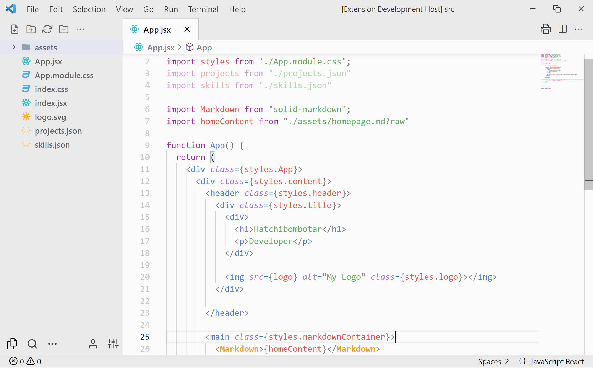

# lovely-light

A VSCode theme that aims to bring a nice, functional look to your light mode text editor.



- File icon theme: [Material Icon Theme](https://marketplace.visualstudio.com/items?itemName=PKief.material-icon-theme)
- Product icon theme: [Feather Product Icons](https://marketplace.visualstudio.com/items?itemName=melishev.feather-vscode)

- The image above also uses the [Customise UI](https://marketplace.visualstudio.com/items?itemName=iocave.customize-ui) Extention with the following settings:
```json
    "customizeUI.activityBar": "bottom",
    "customizeUI.stylesheet": {
        ".label-name": "font-weight: 500;",
        ".title-label": "display: none;",
        ".actions-container": "justify-content: flex-start !important;"
    },
```